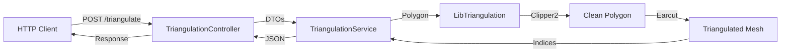

# 🔷 Mesh Processor (C++ Microservice)


**A high-performance, stateless C++ microservice for complex 2D geometric processing.**

This service acts as the computational backend for the [2D Polygon Triangulator](../README.md). It handles complex polygon triangulation operations, specifically optimizing for **self-intersecting polygons** using the `Clipper2` library and `ear-clipping` algorithms.

## 🚀 Key Features

- **Robust Geometry Engine**: Automatically detects and resolves self-intersecting polygons (via `Clipper2`) before triangulation.
- **High Performance**: Optimized C++17 implementation using `mapbox/earcut` (O(n)) for mesh generation.
- **Clean Architecture**: Implements **Controller-Service-Repository** pattern with Dependency Injection for testability.
- **Production Ready**:
  - **Dockerized**: Multi-stage builds (Builder → Test → Runtime) producing a minimal footprint image.
  - **Observability**: Structured logging via `spdlog`.
  - **Resilience**: Graceful error handling and input validation.

## 🛠️ Tech Stack

| Component         | Technology            | Description                                  |
| :---------------- | :-------------------- | :------------------------------------------- |
| **Language**      | **C++17**             | Core logic and memory management             |
| **API**           | `cpp-httplib`         | Lightweight, multi-threaded REST HTTP server |
| **Geometry**      | `Clipper2` / `EarCut` | Intersection resolution & Triangulation      |
| **Serialization** | `nlohmann/json`       | Modern JSON parsing and generation           |
| **Testing**       | **GoogleTest**        | Unit and Integration testing suite           |
| **DevOps**        | Docker / CMake        | Multi-stage container builds                 |

## 🏗️ Architecture

The application follows a strict layered architecture to separate concerns and ensure maintainability:



## ⚡ Quick Start

### Using Docker (Recommended)

Get the service running in under 2 minutes. This automatically runs the test suite during the build process to ensure integrity.

```bash
# Build the optimized runtime image
docker build -t mesh-processor .

# Run the container on port 8080
docker run -p 8080:8080 mesh-processor
```

### Local Development

Prerequisites: `CMake 3.16+`, `C++17 Compiler`, `Git`.

```bash
# 1. Clone & Init Submodules
git submodule update --init --recursive

# 2. Build & Run
mkdir build && cd build
cmake .. -DCMAKE_BUILD_TYPE=Release
cmake --build . -j$(nproc)
./app/MeshProcessor
```

## 🔌 API Reference

### `POST /triangulate`

Accepts a 2D polygon (ordered array of points) and returns the triangulated mesh indices.

**Request:**

```bash
curl -X POST http://localhost:8080/triangulate \
  -H "Content-Type: application/json" \
  -d '[
    [100, 100],
    [200, 100],
    [200, 200],
    [100, 200]
  ]'
```

**Response:**

```json
{
  "vertices": [
    [100, 100],
    [200, 100],
    [200, 200],
    [100, 200]
  ],
  "indices": [0, 1, 2, 0, 2, 3]
}
```

## 🧪 Testing

The project uses **GoogleTest** for unit and integration testing. You can run tests inside an isolated Docker environment:

```bash
# Run tests using the intermediate Docker stage
docker build --target test -t mesh-processor-test .
docker run -it --rm mesh-processor-test
```
